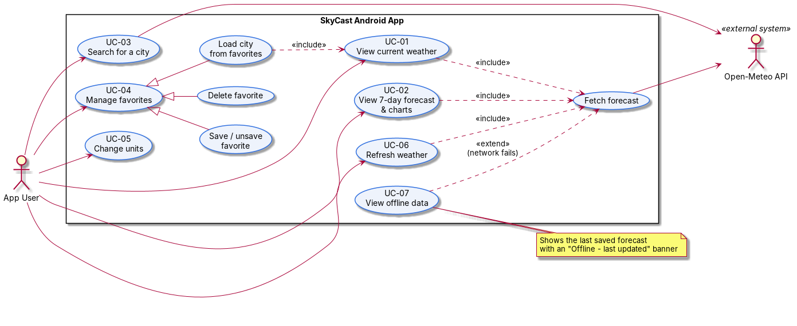
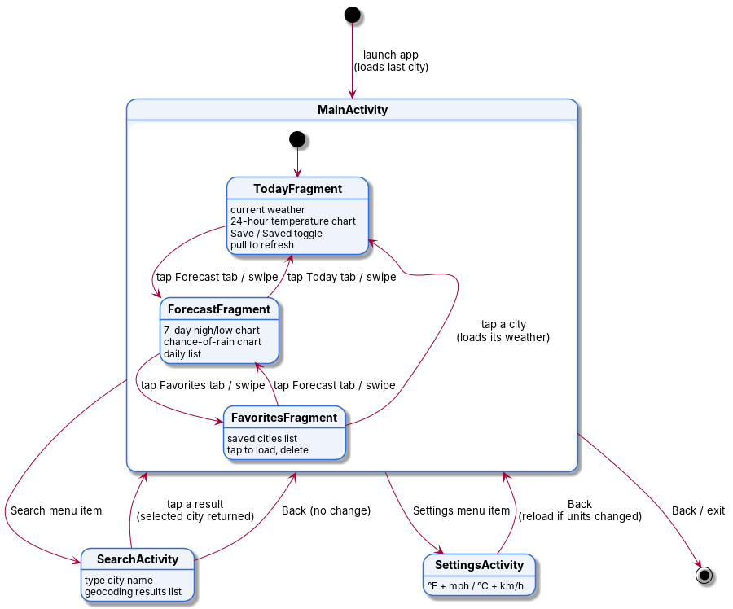
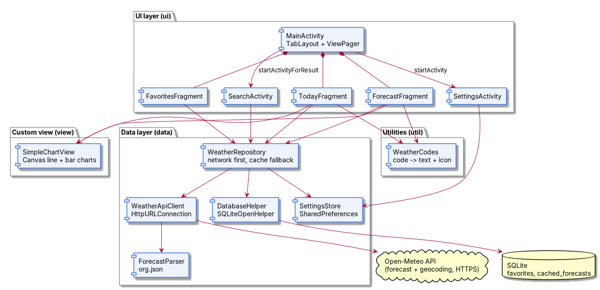

# SkyCast

An Android weather app that shows current conditions, a 7-day forecast and charts for any city, using the free [Open-Meteo API](https://open-meteo.com) (no API key needed).

Individual class project, due Sunday, October 11, 2026. Requirements and SDLC progress are tracked in [process.md](process.md).

## Features

- **Today:** current temperature, feels-like, description, humidity, wind, sunrise and sunset, plus a 24-hour temperature chart
- **Forecast:** 7-day high/low chart, chance-of-rain chart and a daily list
- **Favorites:** save cities, tap one to load it, delete the ones you don't need
- **City search** by name, using Open-Meteo's geocoding API
- **Settings:** °F + mph or °C + km/h, remembered between launches
- **Offline support:** shows the last saved forecast with its "last updated" time
- Pull-to-refresh and clear error messages (no internet, no cities found)

## Screens

| Screen | Type | Purpose |
| --- | --- | --- |
| MainActivity | Activity | Toolbar + tabs hosting the three fragments |
| TodayFragment | Fragment | Current weather and 24-hour chart |
| ForecastFragment | Fragment | 7-day charts and list |
| FavoritesFragment | Fragment | Saved cities |
| SearchActivity | Activity | Find a city and return it to MainActivity |
| SettingsActivity | Activity | Choose units |

## Tech stack

The build setup is copied from an existing working project, so the app uses only Android's built-in APIs and the old support libraries:

- Java, minimum and target SDK 23 (Android 6.0)
- Support libraries 23.0.1: appcompat-v7, design, recyclerview-v7
- `HttpURLConnection` + `org.json` for the API
- `SQLiteOpenHelper` for favorites and the offline cache
- `SharedPreferences` for settings and the last viewed city
- A custom Canvas `View` for the line and bar charts (no chart library)
- `TabLayout` + `ViewPager` for navigation between fragments

## Project structure

| Package | Contents |
| --- | --- |
| `data` | API client, JSON parsing, database helper, settings, models |
| `ui` | Activities, fragments and list adapters |
| `view` | Custom chart view |
| `util` | Weather-code descriptions and icons |

## Running the app

1. Open the project folder in Android Studio.
2. Let Gradle sync. Don't accept any Gradle or Android Gradle Plugin upgrade prompts; the build versions are intentionally fixed.
3. Run on an emulator or a phone with Android 6.0 or newer. The phone needs internet the first time each city loads.

## Diagrams

Each diagram is shown as an image, with a link to its PlantUML source in `docs/diagrams/`.

### Use cases

Source: [usecase.puml](docs/diagrams/usecase.puml)

### Screen flow

Source: [screen_flow.puml](docs/diagrams/screen_flow.puml)

### Architecture

Source: [architecture.puml](docs/diagrams/architecture.puml)
